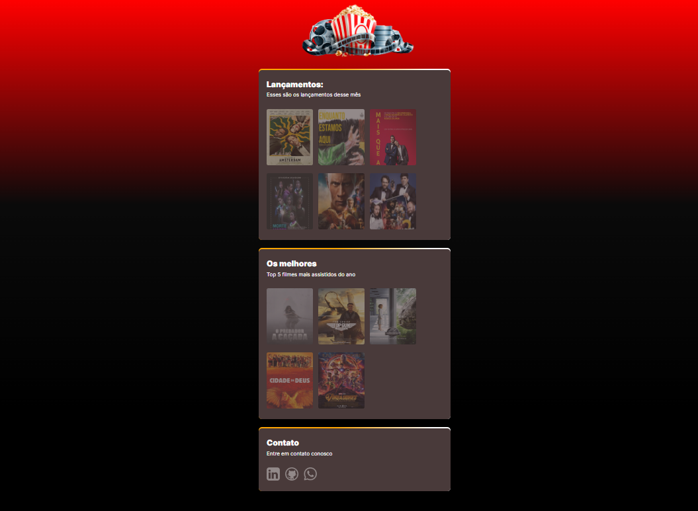

# Filmes Online

> Sobre o projeto
Projeto construido após o curso NLW da RockeatSeat, visando aprimorar meus conhecimentos eu desenvolvi alterando o tema proposto e adicionando alguns efeitos visuais tais como:

- Scroll - quando o usuario usa o scrool mais elementos vão aparecendo. 

- Efeito hover - quando o usuário posiciona o mouse sobre o filme que escolheu acontece um efeito diferente

- Efeitos ao carregar a pagina ultilizando bibliotecas externas

[🔗 clique para acessar:](https://marcelojuniiior.github.io/filmesOnline/)

## 🛠️Tecnologias

- Html
- Css
- JavaScript
- Git
- GitHub

## ☎️ Contatos

- 📲 (48)99620-2252
- 📧 marcelojuniiior@gmail.com